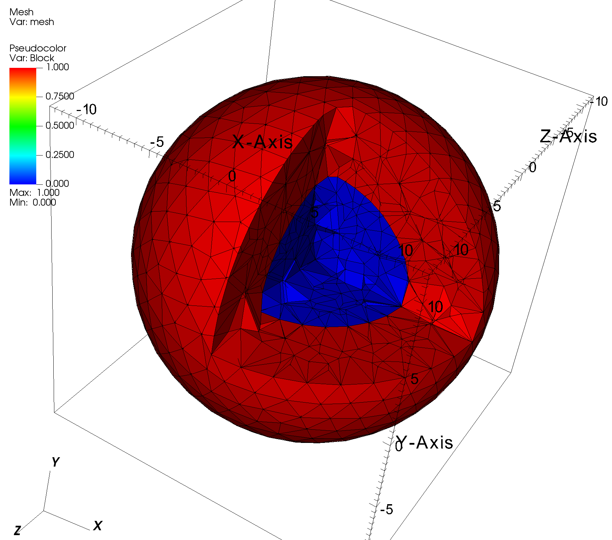
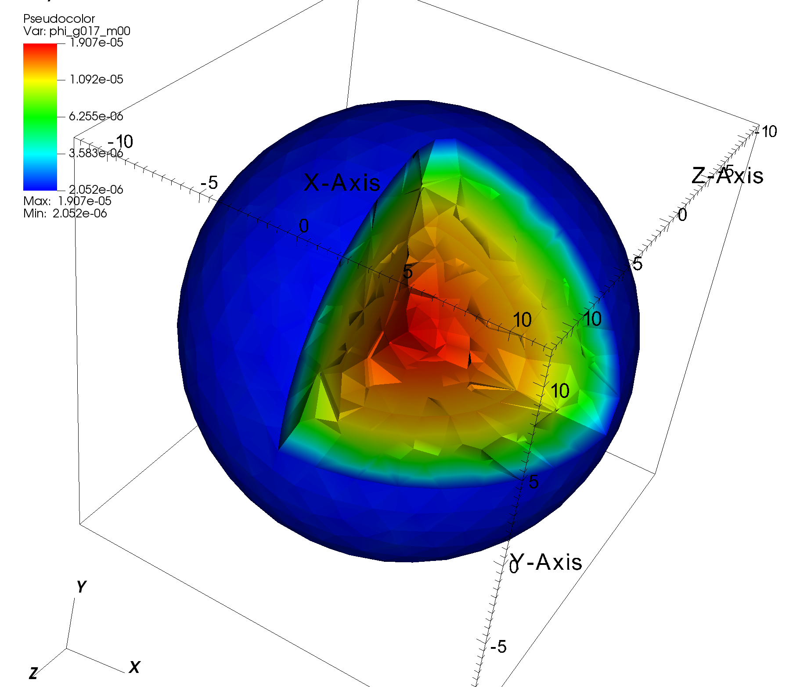

## Criticality Benchmark Problem: HEU-MET-FAST-003

This example is a 3D, eigenvalue problem taken from ICSBEP problem suite, using publicly available data. This example is publicly described here:
- "A Suite of Criticality Benchmarks for Validating Nuclear Data", available on the [DOE OSTI website](https://www.osti.gov/biblio/9404). 

The above-referenced report includes MCNP input files from which dimensions and material compositions were taken.
- A tetrahedral mesh of the problem was generated with [Gmsh](https://gmsh.info/). Two versions of the mesh (coarse and fine) are supplied here.
- Cross sections for each of the two materials were generated in an infinite medium calculation using [OpenMC](https://github.com/openmc-dev/openmc) and the ENDF-VIII.0 nuclear data supplied with OpenMC.
  - The energy group structures (LANL 30 groups and LANL 70 groups) were used and taken from the [Serpent Wiki page](https://serpent.vtt.fi/mediawiki/index.php?title=Pre-defined_energy_group_structures)  

    
The Python OpenSn input file for this example can be found here: [HEU_MET_FAST_003.py](./HEU_MET_FAST_003.py).
- Since Gmsh’s mesh does not exactly preserve spherical-shell volumes, we scale each zone’s cross sections by the true-to-meshed volume ratio to conserve material mass.

The eigenvalue, using the current Python input file, is `1.00165`.

<figure>
  
  <figcaption>Coarse Mesh</figcaption>
   
  
  <figcaption>OpenSn Solution, Group 17 (Coarse Mesh with LANL 30g Structure)</figcaption>
</figure>