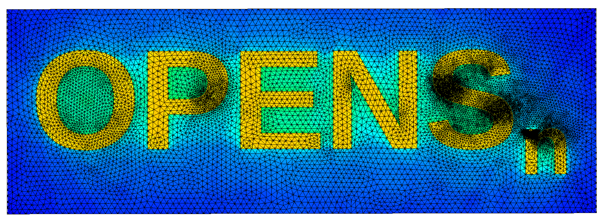

## OpenSn Text Example

This example is a 3D, fixed-source problem with one energy group and two materials. Material #0,
which spells out the word “OpenSn”, is a source region and is embedded in a block of material #1.

The example illustrates a complete CAD-to-OpenSn workflow:

1. The base model is created in OpenSCAD ([opensn.scad](./opensn.scad))
2. OpenSCAD exports the text and block as separate STL files ([opensn1.stl](./opensn1.stl), 
   [opensn2.stl](./openstl2.stl))
3. The STL files are imported into FreeCAD, combined into a single object, and exported to a
   STEP File (opensn.step)
4. The STEP file is meshed using Gmsh ([opensn.geo](./opensn.geo)) and the resulting `.msh` file
   can be read directly by OpenSn
    
The Lua and Python OpenSn input files for this example can be found here: [opensn.lua](./opensn.lua),
[opensn.py](./opensn.py).

