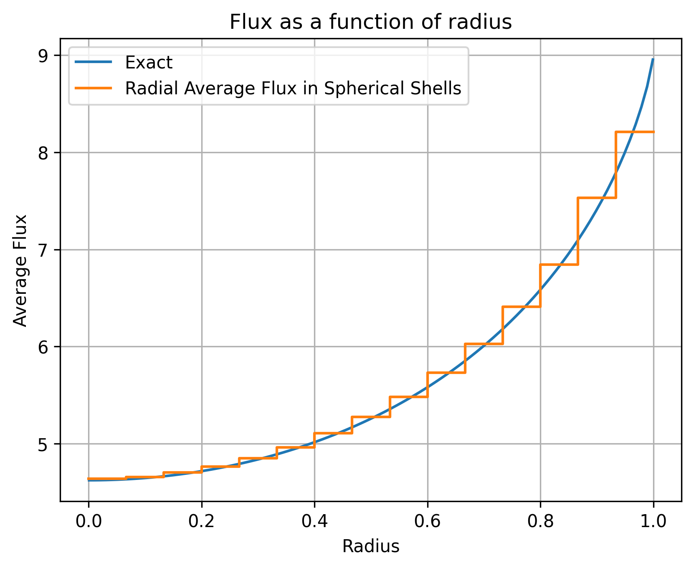
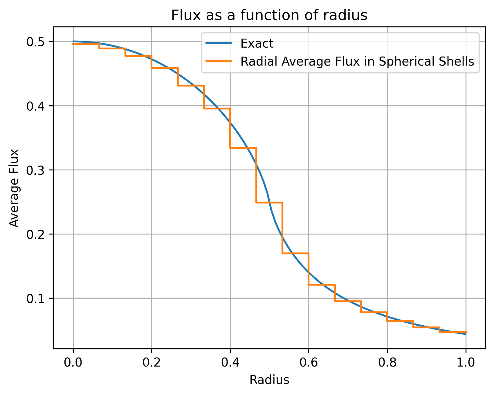
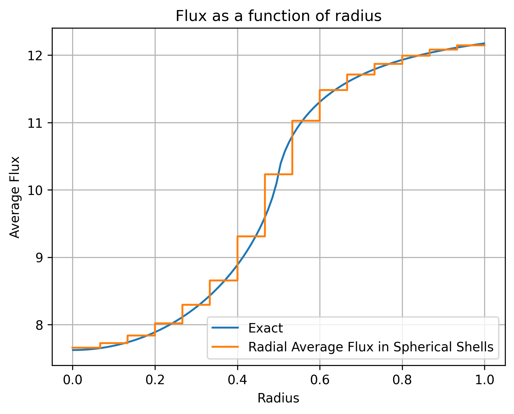
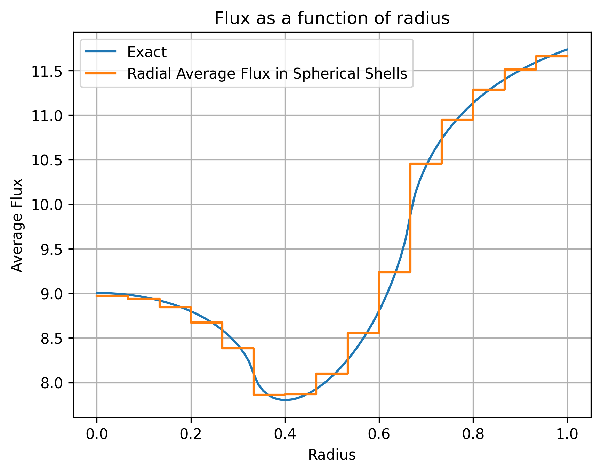
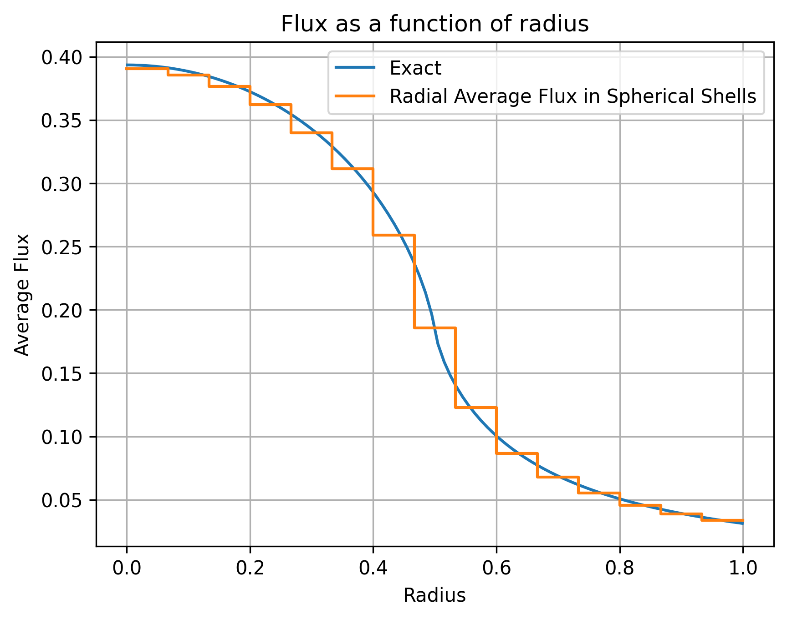

## Six 1-group Spherical Benchmarks

This is a suite of 6 one-group spherical benchmarks taken from the publicly available LLNL technical report:

> Chang, B. (2021)  
> *Six 1D Polar Transport Test Problems for the Deterministic and Monte-Carlo Method*  
> LLNL-TR-819680  
> https://www.osti.gov/servlets/purl/1769096

Each problem involves angular transport in 1D spherical geometry and is solved here using 3D tetrahedral meshes in Gmsh, as a verification exercise. Although exact 1D solutions exist, this approach exercises a general-purpose 3D solver's ability to reproduce spherically symmetric transport behavior.

The scalar flux $\phi(r)$ is computed as the angular integral of the angular flux $\psi(r, \mu)$, and is post-processed using concentric logical spherical shells. The numerical solutions are therefore piecewise-constant averages over these shells. 

The exact analytical scalar flux is also plotted on each figure.

---

### Problem 1: Interior Dirichlet

This test problem models angular flux $\psi_0$ injected uniformly at the outer boundary of a sphere of radius $r_0$, propagating inward through a homogeneous, purely absorbing medium with constant cross-section $\sigma$. The analytic solution is derived from the method of characteristics and integrated to yield the scalar flux $\phi(r)$, involving exponential integral functions.

The Python OpenSn input file for this example can be found here: [Problem_1.py](./Problem_1.py).

<figure>
  
  <figcaption>Solution for Problem-1 (Interior Dirichlet)</figcaption>
</figure>

---

### Problem 2: Radiating Ball

This test describes a spherical source of radius $a$ emitting particles into a vacuum. The scalar flux profile has two regions: inside the ball (source active) and outside the ball (free streaming of escaped flux). The benchmark exercises both source handling and angular cutoff effects in vacuum. In this example, $a=0.5$.

The Python OpenSn input file for this example can be found here: [Problem_2.py](./Problem_2.py).

<figure>
  
  <figcaption>Solution for Problem-2 (Radiating Ball)</figcaption>
</figure>

---

### Problem 3: Radiating Shell

Here, a spherical shell located between radii $a$ and $b$ emits radiation into a surrounding vacuum. The scalar flux solution combines two contributions: one from a full radiating ball of radius $b$, and another subtracted term representing a non-emitting core of radius $a$. This benchmark checks multiple-region source handling.
In this example, $a=1/3$ and $b=2/3$.

The Python OpenSn input file for this example can be found here: [Problem_3.py](./Problem_3.py).

<figure>
  
  <figcaption>Solution for Problem-3 (Radiating Shell)</figcaption>
</figure>

---

### Problem 4: Pacman

This test features a spherical absorber embedded in a vacuum. The incoming boundary flux is attenuated only inside a smaller radius $a$, where absorption occurs. The scalar flux solution includes a closed-form expression inside the absorber and a semi-analytic expression outside, showing a sharp transition near $r = a$. In this example, $a=0.5$.

The Python OpenSn input file for this example can be found here: [Problem_4.py](./Problem_4.py).

<figure>
  
  <figcaption>Solution for Problem-4 (Pacman)</figcaption>
</figure>

---

### Problem 5: Barrier

This benchmark simulates shielding by a shell located between $r = a$ and $r = b$, surrounded by vacuum on both sides. An incoming flux is partially absorbed by the shell before reaching the center, then reflected outward. This problem exercises both inward and outward transport with attenuation.
In this example, $a=1/3$ and $b=2/3$.

The Python OpenSn input file for this example can be found here: [Problem_5.py](./Problem_5.py).

<figure>
  
  <figcaption>Solution for Problem-5 (Barrier)</figcaption>
</figure>

---

### Problem 6: Radiating Absorber

In this final test, a uniformly emitting sphere of radius $a$ radiates into surrounding vacuum, but also absorbs internally. The scalar flux is derived using both analytic and semi-analytic expressions. This test evaluates internal source + attenuation behavior and is useful for checking accuracy of source treatment in absorptive regions. In this example, $a=0.5$.

The Python OpenSn input file for this example can be found here: [Problem_6.py](./Problem_6.py).

<figure>
  
  <figcaption>Solution for Problem-6 (Radiating Absorber)</figcaption>
</figure>
