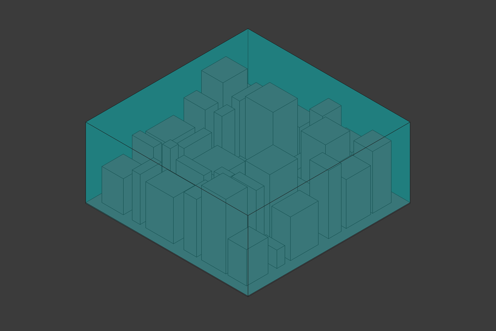
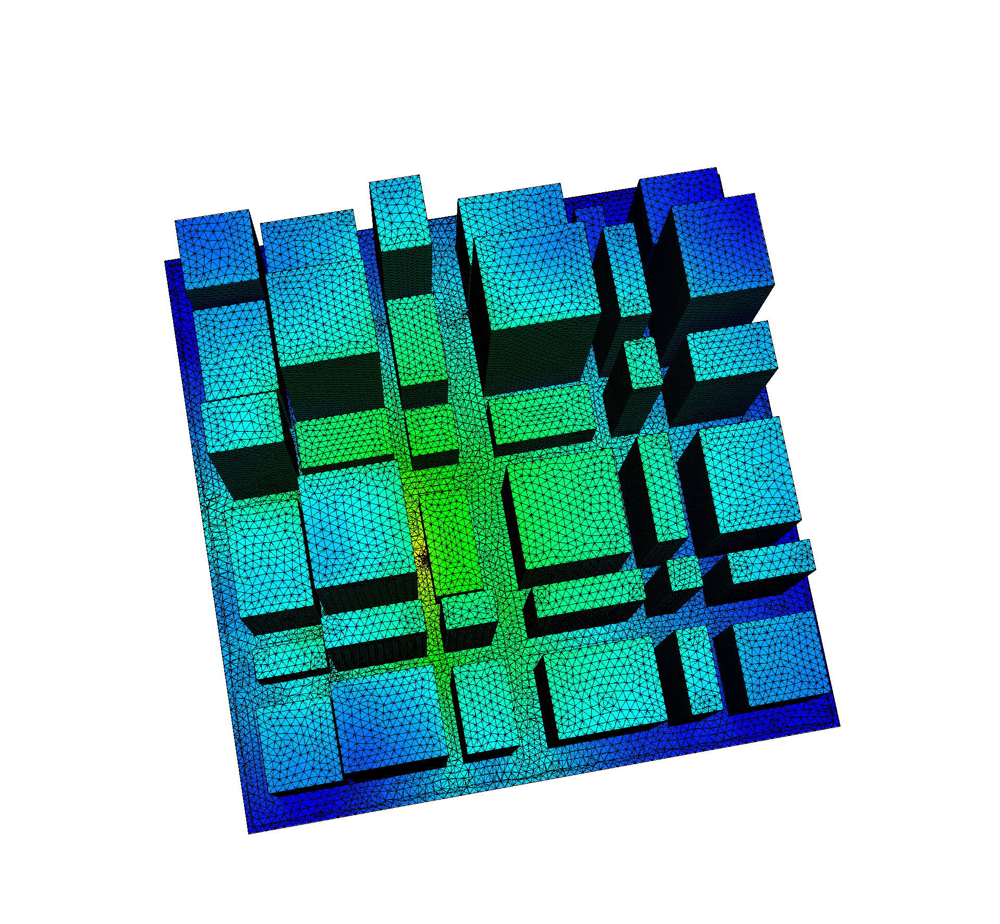
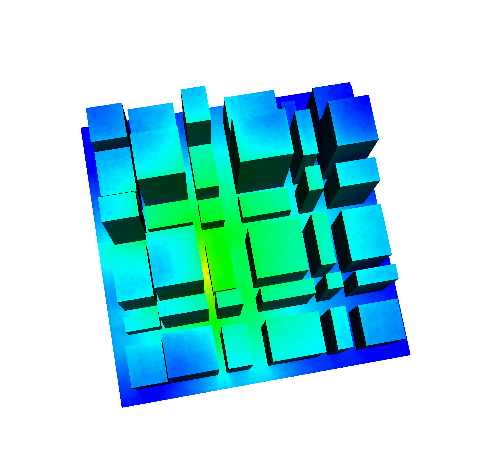

## OpenSn Urban Source Example

This example is a 3D, fixed-source problem with one energy group. The problem models an urban setting
with a random number of concrete buldings of various size and shape. A single source is placed in a 
random location outside a building. The entire model is enclosed in a block of air. The OpenSCAD
script will generate a new random building/source layout every time it is executed.

The example illustrates a complete CAD-to-OpenSn workflow:

1. The base model is created in OpenSCAD ([urban_source.scad](./urban_source.scad))
2. OpenSCAD exports the model as a CSG file ([urban_source.csg](./urban_source.csg))
3. The CSG file is imported into FreeCAD and exported to a STEP File (urban_source.step)
4. The STEP file is meshed using Gmsh ([urban_source.geo](./urban_source.geo)) and the resulting
   `.msh` file can be read directly by OpenSn
    
The Python OpenSn input file for this example can be found here: [urban_source.py](./urban_source.py).

<figure>
  
  <figcaption>CAD Model</figcaption>
   
  
  <figcaption>OpenSn Results with Grid</figcaption>
   
  
  <figcaption>OpenSn Results without Grid</figcaption>
</figure>